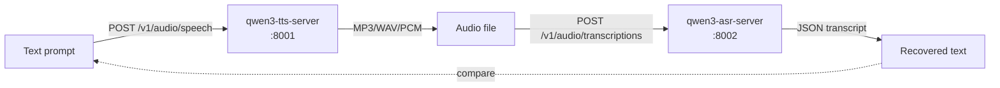

# qwen3-tts-server

OpenAI-compatible HTTP server for [**Qwen3-TTS-12Hz-1.7B-Base**](https://huggingface.co/Qwen/Qwen3-TTS-12Hz-1.7B-Base) with **9 preset voices**, **user-registrable voice clones**, **token-level PCM streaming**, **sentence chunking**, **emotion control**, and **multilingual** generation.

Built for low-latency conversational voice agents — the first audio frame arrives in **~130 ms** on an RTX 4080 SUPER and the model generates speech at **~3–3.4× real-time**.

> Companion project: [**qwen3-asr-server**](https://github.com/malaiwah/qwen3-asr-server) — the matching speech-to-text server.

---

## What you get

- 🎙️ `/v1/audio/speech` — OpenAI-compatible single-shot synthesis (WAV/MP3/Opus)
  - Accepts **JSON body** (`input` field) **or** query parameters — drop-in for OpenAI SDK
  - OpenAI voice aliases (`alloy`, `echo`, `fable`, `onyx`, `nova`, `shimmer`) mapped automatically
- 📦 `/v1/audio/speech/stream` — sentence-chunked streaming (length-prefixed framing)
- ⚡ `/v1/audio/speech/pcm-stream` — **token-level** PCM streaming (~130 ms first chunk)
- 🎭 `instruct=` parameter for emotion/style control (`"Excited and speak quickly."`, `"Whisper softly."`)
- 🗣️ **9 preset voices** (`ryan`, `aiden`, `dylan`, `eric`, `serena`, `vivian`, `sohee`, `ono_anna`, `uncle_fu`) lifted from the CustomVoice checkpoint and shipped as a ~37 KB sidecar bundle
- 🧬 **Voice cloning** via `POST /v1/voices` — upload a reference clip, get back a persistent `vc_<id>` voice usable everywhere the preset names are
- 🌍 Multilingual — English, French, German, Spanish, Italian, Portuguese, Japanese, Korean, Chinese
- 🚦 Barge-in friendly — streams abort cleanly on client disconnect
- 🐳 Docker/Podman — single-container deploy, Ubuntu 24.04, CUDA 12.8
- 🐌 CPU fallback for smoke tests (`--cpu`)

---

## Performance tiers

| Tier | Backend | Requirement | ~Real-time factor | First PCM chunk |
|------|---------|-------------|-------------------|-----------------|
| **1 (default)** | `faster-qwen3-tts` + CUDA graphs | `pip install faster-qwen3-tts` (in container by default) | **~3–3.4×** | **~130 ms** |
| 2 | `qwen_tts` + flash_attention_2 | `pip install flash-attn` | ~2× | ~400 ms |
| 3 | `qwen_tts` + SDPA | PyTorch 2.x built-in, no extra install | ~1.5× | ~500 ms |
| CPU | transformers | no GPU required | ~0.01–0.05× | 30+ s |

The server selects the best available tier at startup and logs which one it's using.
The container image always installs `faster-qwen3-tts` (tier 1).

---

## Host prerequisites (GPU)

Before running the container, install the NVIDIA driver and container toolkit on the host.

```bash
# --- NVIDIA driver (Ubuntu 24.04, from the official CUDA repo) ---
# Open kernel module — recommended for Turing, Ampere, Ada Lovelace, Blackwell
curl -fsSL https://developer.download.nvidia.com/compute/cuda/repos/ubuntu2404/x86_64/3bf863cc.pub \
  | sudo gpg --dearmor -o /etc/apt/keyrings/nvidia-cuda.gpg
printf 'Types: deb\nURIs: https://developer.download.nvidia.com/compute/cuda/repos/ubuntu2404/x86_64/\nSuites: /\nSigned-By: /etc/apt/keyrings/nvidia-cuda.gpg\n' \
  | sudo tee /etc/apt/sources.list.d/nvidia-cuda.sources
sudo apt-get update
sudo apt-get install -y nvidia-driver-open nvidia-container-toolkit

# For Docker — configure runtime and restart
sudo nvidia-ctk runtime configure --runtime=docker
sudo systemctl restart docker

# For Podman — generate CDI specs (enables --device nvidia.com/gpu=all)
sudo nvidia-ctk cdi generate --output=/etc/cdi/nvidia.yaml

# Verify
nvidia-smi
```

> **Driver note**: `nvidia-driver-open` uses the open kernel module and works on Turing+.
> For Pascal and older GPUs use the proprietary variant (`nvidia-driver-XXX`).

---

## Quickstart (Docker / Podman)

```bash
# 1. Run the container — mount a volume for the HF model cache (~3 GB on first run)
docker run -d --name qwen3-tts \
  --gpus all \
  -p 8001:8001 \
  -v qwen3-hf-cache:/root/.cache/huggingface \
  ghcr.io/malaiwah/qwen3-tts-server:latest

# Podman equivalent (requires CDI — see Host prerequisites above):
# podman run -d --name qwen3-tts \
#   --device nvidia.com/gpu=all \
#   -p 8001:8001 \
#   -v qwen3-hf-cache:/root/.cache/huggingface \
#   ghcr.io/malaiwah/qwen3-tts-server:latest

# (Optional) pass a HuggingFace token if needed:
#   -e HF_TOKEN=hf_xxx

# 2. Wait for the model to load (first run downloads ~3 GB; subsequent runs reuse volume)
docker logs -f qwen3-tts   # look for "✓ Server ready — backend: faster-qwen3-tts"

# 3. Try it — using OpenAI-compatible JSON body
curl -s -X POST http://localhost:8001/v1/audio/speech \
  -H "Content-Type: application/json" \
  -d '{"model":"tts-1","input":"Hello from Qwen3","voice":"alloy"}' \
  -o hello.mp3
mpv hello.mp3

# Or query-parameter style (also supported):
curl -s -X POST "http://localhost:8001/v1/audio/speech?text=Hello+from+Qwen3&voice=ryan" \
  -o hello.mp3
```

---

## Quickstart (uv, no container)

```bash
git clone https://github.com/malaiwah/qwen3-tts-server.git
cd qwen3-tts-server
uv venv && source .venv/bin/activate

# GPU (tier 1 — fastest, ~3.4× real-time):
uv pip install torch --index-url https://download.pytorch.org/whl/cu128  # match your CUDA
uv pip install -e ".[gpu]"   # installs faster-qwen3-tts
python server.py              # starts on :8001

# CPU fallback (very slow, smoke tests only):
uv pip install torch --index-url https://download.pytorch.org/whl/cpu
uv pip install -e "."
python server.py --cpu

# In another shell:
./test-tts.py "Hello from Qwen3"                              # writes out.mp3
./test-tts.py "Bonjour le monde" --language French --voice aiden
./test-tts.py "Speak slowly" --instruct "Calm and slow." -o slow.wav --format wav
```

---

## OpenAI SDK drop-in

The server accepts the exact JSON body format the OpenAI Python SDK sends:

```python
from openai import OpenAI

client = OpenAI(
    api_key="not-needed",
    base_url="http://localhost:8001/v1",
)

# OpenAI voice aliases are remapped automatically:
# alloy→ryan, echo→aiden, fable→dylan, onyx→eric, nova→serena, shimmer→vivian
response = client.audio.speech.create(
    model="tts-1",
    voice="alloy",
    input="The quick brown fox jumps over the lazy dog.",
)
response.stream_to_file("output.mp3")
```

---

## Round-trip with qwen3-asr-server



```bash
# 1. Synthesise
./test-tts.py "The quick brown fox jumps over the lazy dog." -o sample.wav --format wav

# 2. Transcribe — run test-asr.py from the qwen3-asr-server repo:
#    https://github.com/malaiwah/qwen3-asr-server
# Or hit the ASR endpoint directly:
curl -s -X POST http://localhost:8002/v1/audio/transcriptions \
  -F model=Qwen/Qwen3-ASR-1.7B \
  -F file=@sample.wav
# → {"text": "The quick brown fox jumps over the lazy dog."}
```

To run both services together with automatic GPU sharing and startup ordering:

```bash
# Clone either repo or save the docker-compose.yml, then:
HF_TOKEN=hf_xxx docker compose up -d
```

See [`docker-compose.yml`](docker-compose.yml) for the full configuration including VRAM budget notes.

---

## Hardware reference (tested)

### Primary (benchmarks below)

| Component | Spec |
|---|---|
| **GPU** | NVIDIA GeForce RTX 4080 SUPER (16 GB VRAM, Ada Lovelace) |
| **CPU** | Intel Core i7-14700 KF (20 cores / 28 threads) |
| **RAM** | 32 GB DDR5 |
| **OS** | Ubuntu 24.04.4 LTS |
| **Driver** | NVIDIA 595.58.03 (CUDA 13.x) |

### Also validated on

| GPU | VRAM | Driver | CUDA compat | Notes |
|-----|------|--------|-------------|-------|
| NVIDIA GeForce RTX 5090 (Vast.ai VM) | 32 GB | 580.95.05 / 595.58.03 | 13.0 / 13.2 | Tier-1; ~19 ms/step, ~4.5× RTF — see two-pass results below |
| NVIDIA GeForce RTX 4090 (Vast.ai VM) | 24 GB | 580.126.09 | 13.0 | Tier-1; ~19 ms/step, ~4.2× RTF |
| NVIDIA GRID A100D-20C (Vultr vGPU) | 20 GB | 550.90.07 | ≤ 12.4 | cu128 image works fine; driver locks at 550 |
| CPU-only (no GPU) | — | — | — | `--cpu` flag; very slow |

### Performance (RTX 4080 SUPER, tier-1 backend)

| Workload | Length | Wall time | Real-time factor |
|---|---|---|---|
| First PCM chunk (320 ms audio) | 7 680 samples | **131 ms** | ~2.4× |
| Short reply (~9 s audio) | 27 chunks | 2.66 s | ~3.4× |
| Medium reply (~40 s audio) | 126 chunks | 12.58 s | ~3.2× |
| Long reply (~80 s audio) | 255 chunks | 25.47 s | ~3.2× |

VRAM footprint: **~4.4 GB** (bfloat16 + CUDA-graph warmup).

### Performance (GRID A100D-20C vGPU, tier-1 backend)

*Measured on Vultr GRID A100D-20C (20 GB vGPU), driver 550.90.07, CUDA 12.4,
cu128 container, faster-qwen3-tts (CUDA graphs, tier 1).*

The A100D-20C is a virtualised 20 GB slice of an A100 80 GB. The vGPU hypervisor
allocates ≈25% of the compute budget, so single-stream inference is slower than a
consumer card despite the HBM2e memory:

| Workload | Audio | Wall time | Real-time factor | Step time |
|---|---|---|---|---|
| Short sentence (9 words) | ~3 s | ~2.3 s | ~1.4× | ~57 ms/step |
| First PCM chunk | 320 ms | **~350 ms** | — | — |

VRAM footprint: **~14.4 GB** when co-located with the ASR vLLM server (18.8 GB / 20 GB total).

### Performance (RTX 5090, tier-1 backend — two-pass driver comparison)

*Measured on Vast.ai NVIDIA GeForce RTX 5090 (32 GB VRAM, Blackwell sm_12.0),
Ubuntu 22.04 VM, faster-qwen3-tts (CUDA graphs, tier 1) — steady-state (4 runs averaged per pass).*

Two passes were run on the same machine to isolate the effect of a driver upgrade:

| Pass | Driver | CUDA compat | Short (~3s) wall | Short RTF | Medium (~12s) wall | Medium RTF | Long (~30s) wall | Long RTF | PCM first chunk |
|------|--------|-------------|-----------------|-----------|-------------------|------------|-----------------|----------|----------------|
| 1 (stock) | 580.95.05 | 13.0 | 0.78 s | **4.34×** | 2.80 s | **4.53×** | 6.70 s | **4.57×** | **178 ms** |
| 2 (upgraded) | 595.58.03 | 13.2 | 0.81 s | **4.39×** | 2.73 s | **4.56×** | 6.73 s | **4.59×** | **177 ms** |

**TTS performance is identical across both driver versions** — within measurement noise.
The faster-qwen3-tts tier-1 backend is insensitive to the driver bump on this GPU.

VRAM footprint: **~4.4 GB** TTS alone; **~28 GB** when co-located with ASR (both models on one RTX 5090).

### Performance (RTX 4090, tier-1 backend)

*Measured on Vast.ai NVIDIA GeForce RTX 4090 (24 GB VRAM), driver 580.126.09, CUDA 13.0,
Ubuntu 22.04 VM, faster-qwen3-tts (CUDA graphs, tier 1) — steady-state (warm model, 4 runs averaged).*

| Workload | Audio | Wall time | Real-time factor | Step time |
|---|---|---|---|---|
| Short sentence (~3.1 s) | ~3.1 s | **0.74 s** | ~4.2× | **~19 ms/step** |
| Longer sentence (~8.8 s) | ~8.8 s | **2.04 s** | ~4.3× | ~19 ms/step |

VRAM footprint: **~4.4 GB** (same as RTX 4080 SUPER).

The RTX 4090's larger SM count and higher memory bandwidth deliver ~0.5–1× faster RTF and
~10 ms/step lower latency compared with the RTX 4080 SUPER, while the VRAM footprint is
identical — leaving ~19 GB free for co-located workloads.

---

## API reference

### `POST /v1/audio/speech` — single-shot synthesis

Accepts **JSON body** or **query parameters**.

| Param | Default | Notes |
|---|---|---|
| `input` / `text` | *(required)* | Text to synthesise. `input` preferred (OpenAI SDK compat). |
| `model` | `tts-1` | Accepted for OpenAI compat; always uses the configured Qwen3-TTS checkpoint. |
| `voice` | `ryan` | Preset name (`ryan`, `vivian`, …), OpenAI alias (`alloy`, `nova`, …), or a registered clone ID (`vc_ab12cd34`). See `GET /v1/voices`. |
| `language` | `English` | `English`, `French`, `Chinese`, `German`, `Spanish`, … |
| `instruct` | *(none)* | Style hint, e.g. `"Excited and speak quickly."` |
| `response_format` | `mp3` | `mp3`, `wav`, or `opus` |
| `speed` | `1.0` | Accepted for OpenAI compat; Qwen3-TTS does not support speed control. |

### `POST /v1/audio/speech/stream` — sentence-chunked

Same parameters as above (JSON body or query params). Streams one self-contained audio file
per sentence with length-prefixed framing:

```
[4 bytes BE uint32: chunk_length][chunk_length bytes: audio]
[4 bytes BE uint32: chunk_length][chunk_length bytes: audio]
... (stream ends on socket close)
```

### `POST /v1/audio/speech/pcm-stream` — token-level PCM (tier-1 only)

Yields raw **24 kHz mono int16 PCM** frames as the model generates them.
First chunk latency ≈ **130 ms** on RTX 4080 SUPER.
A zero-length frame marks end of stream.
**Requires `faster-qwen3-tts`** (tier-1 backend — installed by default in the container).

| Param | Default | Notes |
|---|---|---|
| `chunk_size` | `4` | Codec frames per yield (lower = lower latency, more overhead) |

### `GET /v1/voices` — list all voices

Returns preset speakers **and** user-registered clones, plus the OpenAI alias mapping:

```json
{
  "data": [
    {"id": "aiden", "kind": "preset", "name": "aiden", "gender": "m", "lang": "en,zh"},
    {"id": "vivian", "kind": "preset", "name": "vivian", "gender": "f", "lang": "en,zh"},
    {"id": "vc_ab12cd34", "kind": "custom", "name": "Alice", "created_at": 1734567890, "ref_text": "...", "x_vector_only_mode": false, "icl_mode": true}
  ],
  "openai_voice_aliases": {"alloy": "ryan", ...}
}
```

`GET /voices` is kept as a deprecated alias that returns the same shape.

### `POST /v1/voices` — register a voice clone

Multipart form with an audio reference clip, returns the new voice record (201 Created).

| Form field | Required | Notes |
|---|---|---|
| `name` | yes | Human-friendly label (any string). |
| `audio` | yes | Reference clip. 3–30 s recommended. WAV/MP3/FLAC/OGG. |
| `ref_text` | no | Transcript of the clip. When provided, enables full **in-context learning mode** (closer clone, prosody-aware). Without it, falls back to **x-vector-only** mode. |
| `language` | no | Metadata only (e.g. `"English"`, `"French"`). |

```bash
# x-vector-only clone (no transcript needed)
curl -X POST http://localhost:8001/v1/voices \
    -F "name=Alice" \
    -F "audio=@alice_sample.wav"
# → {"id":"vc_ab12cd34","kind":"custom","name":"Alice",...}

# Full ICL clone (prosody-aware)
curl -X POST http://localhost:8001/v1/voices \
    -F "name=Bob" \
    -F "audio=@bob_sample.wav" \
    -F "ref_text=The quick brown fox jumps over the lazy dog."

# Use the clone like any other voice
curl -X POST http://localhost:8001/v1/audio/speech \
    -H 'Content-Type: application/json' \
    -d '{"input":"Hello from my clone","voice":"vc_ab12cd34"}' \
    --output clone_out.mp3
```

Clones persist to `$QWEN3_TTS_VOICES_DIR/custom/` (default `/data/voices/custom/`)
as `<id>.safetensors` + `<id>.json` sidecars, ~13 KB total per clone.
Mount that path as a volume so clones survive container restarts.

### `DELETE /v1/voices/{voice_id}` — remove a clone

Returns `200 {"id":"vc_...","deleted":true}` on success, `404` if unknown, `403` if the target is a preset (presets are immutable).

### `GET /health`, `GET /v1/models`

Standard introspection endpoints.  `/health` includes the active backend tier.

### `GET /metrics` — Prometheus exposition

Plain-text Prometheus exposition for scraping by Prometheus/VictoriaMetrics/OTEL collectors.
Always unauthenticated (standard ops convention).  Exposed metrics:

| Metric | Type | Labels | Meaning |
|---|---|---|---|
| `qwen3_tts_requests_total` | counter | `method, path, status` | HTTP requests handled |
| `qwen3_tts_request_duration_seconds` | histogram | `method, path` | Request latency |
| `qwen3_tts_requests_in_flight` | gauge | — | Requests currently in progress |
| `qwen3_tts_model_ready` | gauge | — | 1 when the model is loaded, 0 otherwise |
| `qwen3_tts_backend_info` | gauge | `device, backend, model_id` | Always 1; labels describe the backend |

Standard `process_*` and `python_gc_*` metrics are included automatically by
`prometheus_client`.

---

## Authentication (optional)

By default the server is unauthenticated (matching typical self-hosted usage).
To require a bearer token on `/v1/*` endpoints set either an env var or a CLI flag:

```bash
# Env var (recommended for containers)
docker run -e QWEN_API_KEY=sk-mysecret ghcr.io/malaiwah/qwen3-tts-server:latest …

# Or CLI flag
python server.py --api-key sk-mysecret
```

Callers must then send `Authorization: Bearer sk-mysecret`.
`/health` and `/metrics` stay unauthenticated regardless, so ops scrapers and
container health checks keep working.

```python
from openai import OpenAI
client = OpenAI(api_key="sk-mysecret", base_url="http://localhost:8001/v1")
```

---

## Configuration

| Env var | Default | Purpose |
|---|---|---|
| `QWEN3_TTS_MODEL_ID` | `Qwen/Qwen3-TTS-12Hz-1.7B-Base` | Override the HF model. Only `-Base` supports the clone path. |
| `QWEN3_TTS_MAX_TEXT_LENGTH` | `10000` | Maximum input characters (returns HTTP 413 if exceeded). |
| `QWEN3_TTS_MAX_REF_AUDIO_BYTES` | `10485760` | Maximum reference-audio upload size for `POST /v1/voices`. |
| `QWEN3_TTS_VOICES_DIR` | `/data/voices` | Where user-registered clones persist. **Mount a volume here.** |
| `QWEN3_TTS_PRESET_BUNDLE` | `assets/preset/bundle.safetensors` | Override preset bundle location. |
| `QWEN3_TTS_DEFAULT_VOICE` | `ryan` | Default voice when the client omits `voice`. |
| `HF_HOME` | `/root/.cache/huggingface` | Where weights are cached. **Mount a volume here.** |
| `HF_TOKEN` | *(unset)* | HuggingFace token for gated downloads. |
| `QWEN_API_KEY` | *(unset)* | Require `Authorization: Bearer <key>` on `/v1/*`. |

CLI flags:

| Flag | Default | Purpose |
|---|---|---|
| `--host` | `0.0.0.0` | Bind address |
| `--port` | `8001` | Listen port |
| `--api-key` | *(env / off)* | Overrides `QWEN_API_KEY` for bearer-token auth |
| `--cpu` | *(off)* | Force CPU mode. **Very slow.** |
| `--log-level` | `info` | Uvicorn log level |

---

## Benchmarking

A standalone `benchmark.py` measures steady-state wall-clock latency + RTF
across short/medium/long workloads:

```bash
./benchmark.py                                   # built-in workloads, 5 runs
./benchmark.py --url http://my-gpu-host:8001 --voice aiden --language French
./benchmark.py --workloads short,long --runs 10
./benchmark.py --text "Custom sentence to time."
```

First run per workload is warmup (excluded from the average); the rest feed a
simple mean.  The RTX 4080 SUPER / 5090 numbers in the tables above were
produced with this script.

---

## Building from source

```bash
docker build -t qwen3-tts-server:latest -f Containerfile .
# or
podman build -t qwen3-tts-server:latest -f Containerfile .
```

The CI workflow builds and pushes to `ghcr.io/malaiwah/qwen3-tts-server:latest`
on every push to `main` and version tags (`v0.1.0`, etc.).

**Supply-chain metadata.** Each pushed image carries:

- an **SPDX SBOM** attestation (generated by buildx)
- a **SLSA build provenance** attestation (mode=max)

Inspect either with:

```bash
docker buildx imagetools inspect \
  --format '{{ json .SBOM }}' \
  ghcr.io/malaiwah/qwen3-tts-server:latest
```

**Vulnerability scanning.** Every push to `main` / tags runs Trivy against the
freshly-built image and uploads SARIF findings to this repo's
[Security tab](https://github.com/malaiwah/qwen3-tts-server/security).
The scan is non-blocking — upstream CUDA base images routinely carry
known CVEs outside our control.

---

## Tests

Smoke tests run without a GPU or model load and are CI-safe:

```bash
uv pip install -e ".[test]"
pytest -q
```

---

## CPU mode

CPU inference is **orders of magnitude slower** — 30 s+ per short sentence.
Use it only for smoke tests, API surface exploration, or environments without a GPU.

For conversational use, a CUDA GPU with ≥ 6 GB VRAM is required.

---

## Acknowledgements

- [Qwen team @ Alibaba](https://huggingface.co/Qwen) for the [Qwen3-TTS-Base](https://huggingface.co/Qwen/Qwen3-TTS-12Hz-1.7B-Base) and [Qwen3-TTS-CustomVoice](https://huggingface.co/Qwen/Qwen3-TTS-12Hz-1.7B-CustomVoice) models. The preset-voice bundle in `assets/preset/` is derived from CustomVoice; provenance is documented in [discussion #45](https://huggingface.co/Qwen/Qwen3-TTS-12Hz-1.7B-CustomVoice/discussions/45) and mirrored at [`malaiwah/qwen3-tts-preset-voices`](https://huggingface.co/datasets/malaiwah/qwen3-tts-preset-voices).
- [`faster-qwen3-tts`](https://pypi.org/project/faster-qwen3-tts/) for CUDA-graph-accelerated inference
- [`qwen-tts`](https://pypi.org/project/qwen-tts/) for the reference inference path

---

## License

[MIT](LICENSE) — free for any use; please credit the upstream Qwen model card and follow its license terms separately.
