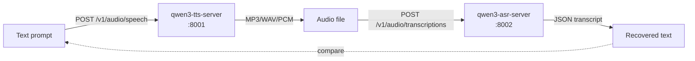

# qwen3-tts-server

OpenAI-compatible HTTP server for [**Qwen3-TTS-12Hz-1.7B-CustomVoice**](https://huggingface.co/Qwen/Qwen3-TTS-12Hz-1.7B-CustomVoice) with **token-level PCM streaming**, **sentence chunking**, **emotion control**, and **bilingual** (English / French / Chinese / etc.) generation.

Built for low-latency conversational voice agents — the first audio frame arrives in **~130 ms** on an RTX 4080 SUPER and the model generates speech at **~3× real-time**.

> Companion project: [**qwen3-asr-server**](https://github.com/malaiwah/qwen3-asr-server) — the matching speech-to-text server. Together they form a complete voice loop: text → TTS → audio → ASR → text.

---

## What you get

- 🎙️ `/v1/audio/speech` — OpenAI-compatible single-shot synthesis (WAV/MP3/Opus)
- 📦 `/v1/audio/speech/stream` — sentence-chunked streaming (length-prefixed framing)
- ⚡ `/v1/audio/speech/pcm-stream` — **token-level** PCM streaming (gap-free, ~130 ms first-chunk latency)
- 🎭 `instruct=` parameter for emotion/style control (`"Excited and speak quickly."`, `"Whisper softly."`)
- 🗣️ 9 built-in voices (`ryan`, `aiden`, `dylan`, `eric`, `serena`, `vivian`, `sohee`, `ono_anna`, `uncle_fu`)
- 🌍 Multilingual — English, French, German, Spanish, Italian, Portuguese, Japanese, Korean, Chinese
- 🚦 Barge-in friendly — streams abort cleanly on client disconnect
- 🐳 Single-container deploy with HuggingFace cache volume
- 🐌 CPU fallback for smoke tests (no GPU? still usable)

---

## Quickstart (Docker / Podman)

```bash
# 1. Run the container — mount a volume for the HF model cache (~3 GB once cached)
podman run -d --name qwen3-tts \
  --device nvidia.com/gpu=all \
  -p 8001:8001 \
  -v qwen3-hf-cache:/root/.cache/huggingface \
  ghcr.io/malaiwah/qwen3-tts-server:latest

# (Optional) supply a HuggingFace token if you've gated your downloads
#   -e HF_TOKEN=hf_xxx

# 2. Wait for the model to load (first run downloads ~3 GB; subsequent runs reuse the volume)
podman logs -f qwen3-tts   # look for "CUDA graph warmup done"

# 3. Try it
curl -X POST "http://localhost:8001/v1/audio/speech?text=Hello+from+Qwen3&voice=ryan" -o hello.mp3
mpv hello.mp3   # or any audio player
```

---

## Quickstart (uv, no container)

```bash
git clone https://github.com/malaiwah/qwen3-tts-server.git
cd qwen3-tts-server
uv venv && source .venv/bin/activate
uv pip install -e ".[gpu]"            # add ",test" to also install pytest
python server.py                       # add --cpu to run on CPU (slow)

# In another shell:
./test-tts.py "Hello from Qwen3"                              # writes out.mp3
./test-tts.py "Bonjour le monde" --language French --voice aiden
./test-tts.py "Speak slowly" --instruct "Calm and slow." -o slow.wav --format wav
```

---

## Round-trip with qwen3-asr-server

The two servers compose naturally — generate speech with one, transcribe it with the other to verify both:



```bash
# 1. Synthesise
./test-tts.py "The quick brown fox jumps over the lazy dog." -o sample.wav --format wav

# 2. Transcribe (using qwen3-asr-server)
./test-asr.py sample.wav   # see github.com/malaiwah/qwen3-asr-server
```

---

## Hardware reference (tested)

The numbers below come from a single GPU host nicknamed **Creativity**:

| Component | Spec |
|---|---|
| **GPU** | NVIDIA GeForce RTX 4080 SUPER (16 GB VRAM, Ada Lovelace) |
| **CPU** | Intel Core i7-14700 KF (20 cores / 28 threads) |
| **RAM** | 32 GB DDR5 |
| **OS** | Ubuntu 24.04.4 LTS |
| **Driver** | NVIDIA 595.58.03 (CUDA 13.x) |

### Performance (sustained, real production traffic)

| Workload | Length | Wall time | Real-time factor |
|---|---|---|---|
| First PCM chunk (320 ms audio) | 7 680 samples | **131 ms** | ~2.4× faster than RT |
| Short reply (140 chars, ~9 s audio) | 27 chunks | 2.66 s | ~3.4× |
| Medium reply (467 chars, ~40 s audio) | 126 chunks | 12.58 s | ~3.2× |
| Long reply (1 019 chars, ~80 s audio) | 255 chunks | 25.47 s | ~3.2× |

VRAM footprint: **~4.4 GB** with `flash_attention_2` + bfloat16 + CUDA-graph warmup.
Leaves room on a 16 GB card for a separate ASR model (see qwen3-asr-server).

---

## API reference

### `POST /v1/audio/speech` — single-shot synthesis

| Param | Default | Notes |
|---|---|---|
| `text` | *(required)* | UTF-8 text, any length (capped by client) |
| `voice` | `ryan` | One of `GET /voices` |
| `language` | `English` | `English`, `French`, `Chinese`, `German`, `Spanish`, ... |
| `instruct` | *(none)* | Style hint, e.g. `"Excited and speak quickly."` |
| `response_format` | `mp3` | `mp3`, `wav`, or `opus` |

Returns the audio bytes inline. Response headers include `X-Latency-Ms` and `X-Gen-Time-Ms`.

### `POST /v1/audio/speech/stream` — sentence-chunked

Same parameters as above. Splits text on sentence boundaries (`.!?`) and streams one self-contained audio file per sentence using length-prefixed framing:

```
[4 bytes BE uint32: chunk_length][chunk_length bytes: audio]
[4 bytes BE uint32: chunk_length][chunk_length bytes: audio]
... (stream ends on socket close)
```

### `POST /v1/audio/speech/pcm-stream` — token-level PCM (recommended for live agents)

Yields raw 24 kHz mono int16 PCM frames as the model generates them — perceived latency ≈ 130 ms.
A zero-length frame marks end of stream.  **Requires `faster-qwen3-tts`** (installed by default in the container).

| Param | Default | Notes |
|---|---|---|
| `chunk_size` | `4` | Codec frames per yield (lower = lower latency, more overhead) |

### `GET /voices`, `GET /v1/models`, `GET /health`

Standard introspection endpoints.

---

## Configuration

| Env var | Default | Purpose |
|---|---|---|
| `QWEN3_TTS_MODEL_ID` | `Qwen/Qwen3-TTS-12Hz-1.7B-CustomVoice` | Override the HF model (must be Qwen3-TTS-compatible) |
| `HF_HOME` | `/root/.cache/huggingface` | Where weights are cached. **Mount a volume here.** |
| `HF_TOKEN` | *(unset)* | Optional — only needed if you've gated downloads on your account |

CLI flags (when running `server.py` directly):

| Flag | Default | Purpose |
|---|---|---|
| `--host` | `0.0.0.0` | Bind address |
| `--port` | `8001` | Listen port |
| `--cpu` | *(off)* | Run on CPU. **Slow.** Forced on if no CUDA device is detected. |
| `--log-level` | `info` | Uvicorn log level |

---

## Building from source

```bash
podman build -t qwen3-tts-server:latest -f Containerfile .
```

The CI workflow in `.github/workflows/build.yml` builds and pushes
to `ghcr.io/<owner>/qwen3-tts-server:latest` on every push to `main`
plus version tags (`v0.1.0`, `v0.1`, `latest`).

---

## Tests

Smoke tests run without a model load and are GPU-free, so they fit in CI:

```bash
uv pip install -e ".[test]"
pytest -q
```

---

## CPU mode warning

CPU inference works but is **orders of magnitude slower** — generation can be 30 s+ per short sentence. Use it only for:
- environments without an NVIDIA GPU
- smoke tests / CI
- demonstrating the API surface

For real conversational use, a CUDA GPU with ≥ 6 GB VRAM is strongly recommended.

---

## Acknowledgements

- [Qwen team @ Alibaba](https://huggingface.co/Qwen) for the [Qwen3-TTS-CustomVoice](https://huggingface.co/Qwen/Qwen3-TTS-12Hz-1.7B-CustomVoice) model
- [`faster-qwen3-tts`](https://pypi.org/project/faster-qwen3-tts/) for CUDA-graph-accelerated inference
- [`qwen-tts`](https://pypi.org/project/qwen-tts/) for the reference inference path

---

## License

[MIT](LICENSE) — free for any use; please credit the upstream Qwen model card and follow its license terms separately.
